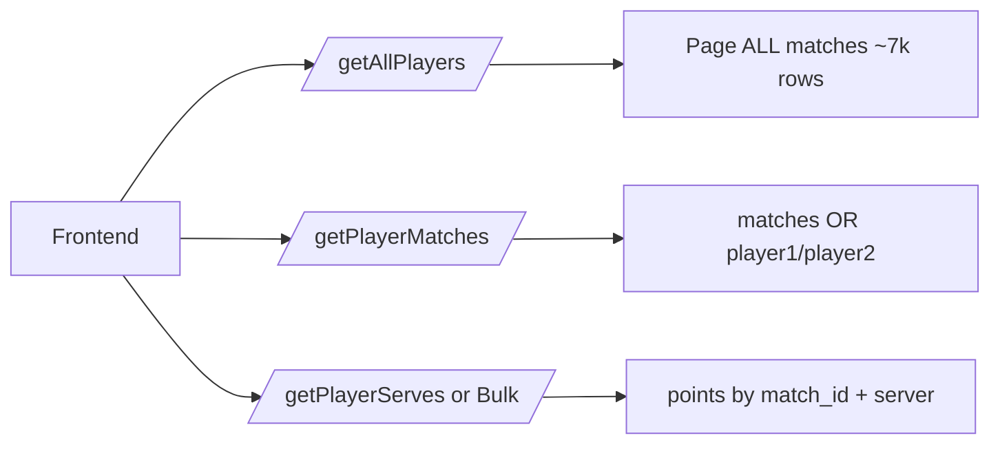

<!-- ff383a97-0c71-452f-95b0-99ab8da651fd -->
---
todos:
  - id: "sql-indexes-players"
    content: "Add SQL: indexes, players table, name-normalization backfill + diagnostic queries"
    status: pending
  - id: "backend-cache"
    content: "Add TTL cache + document/enforce single-worker; secure header-based cache clear"
    status: pending
  - id: "backend-players-endpoint"
    content: "Rewrite getAllPlayers from players table; sync+normalize names in loadData"
    status: pending
  - id: "backend-matches-two-eq"
    content: "Unconditionally replace .or_() with two .eq() queries + merge; TTL-cache results"
    status: pending
  - id: "backend-bulk-parallel"
    content: "Module-level executor + global semaphore for bulk points; sync route discipline"
    status: pending
  - id: "frontend-swr-cache"
    content: "Add localStorage SWR cache for players and matches in matchsimulator page"
    status: pending
isProject: false
---
# Backend + search performance plan (revised)

## What’s slow today (ranked)



| Bottleneck | Why it hurts | Scale |
|---|---|---|
| [`getAllPlayers`](backend/main.py) pages every `matches` row and builds a Python `set` | ~7–8 Supabase round-trips per request; runs on every page load even though the list rarely changes | ~7.2k matches |
| No DB indexes (none in repo / load pipeline) | `player1` / `player2` / `surface` filters and `points(match_id, server)` can seq-scan | ~547k points |
| [`getPlayerServesBulk`](backend/main.py) sequential `.in_()` batches of 80 + `.range()` pages | “Select all” for a busy player = many serial HTTP calls to Supabase | worst case tens of thousands of points |
| Frontend only [`sessionStorage`](frontend/src/app/matchsimulator/page.js) for players; **no** matches cache | New tab / refresh always hits API; match lists refetch every surface pick | UX delay |

Chosen approach: **durable schema fixes + single-worker process TTL cache + globally bounded parallel bulk reads + frontend localStorage SWR**.

---

## Review responses (items 1–7)

### 1. In-memory cache vs multi-worker — **accepted; constrain deployment**

Repo has **no** Render/Railway/Fly/Dockerfile/`Procfile` — only `uvicorn` in [`backend/requirements.txt`](backend/requirements.txt). There is no evidence of multi-worker production today.

**Decision:** keep process-local TTL cache, but make the assumption **explicit and enforced in docs/startup**, not implicit:

- Document and use: `uvicorn main:app --host 0.0.0.0 --port 8000 --workers 1`
- Add a short comment at the top of [`backend/cache.py`](backend/cache.py): *process-local; requires `--workers 1`. Multi-worker / horizontal scale ⇒ replace with shared store or drop server cache.*
- Do **not** introduce Redis yet (still out of scope). If deployment later scales workers, the players table + indexes + frontend SWR still carry the win; server cache becomes optional.

**Not refused:** multi-worker would make `/admin/cache/clear` incomplete and TTLs diverge per process. Constraining to one worker is the correct cheap fix for this project size.

### 2. Global concurrency bound — **accepted**

Per-request worker caps are insufficient under concurrent “select all” users.

**Decision:** module-level shared pool + **global semaphore**:

- One `ThreadPoolExecutor` created at import/startup (see item 7)
- One `threading.BoundedSemaphore` (e.g. `SUPABASE_MAX_INFLIGHT = 8`, env-overridable) acquired around **every** Supabase `.execute()` used by bulk pagination helpers
- Per-request code submits work to that shared pool; it cannot exceed the global semaphore regardless of how many HTTP requests fan out

### 3. Blocking event-loop trap — **accepted; design to prevent it**

**Decision:**

- Keep FastAPI route handlers that touch Supabase as plain **`def`** (not `async def`). FastAPI runs sync endpoints in its worker threadpool, so blocking Supabase calls do not stall the asyncio loop.
- All parallel bulk work goes through the **module-level** executor; never call `.execute()` on the event-loop thread from an `async def`.
- Post-build sanity check (document in verify list): if any route is later made `async`, wrap sync Supabase work with `await asyncio.get_running_loop().run_in_executor(SHARED_EXECUTOR, fn)` — fail the review if a bare `.execute()` appears in `async def`.

### 4. Two-`.eq()` unconditionally — **accepted**

Drop the “prefer when faster” wording. **`getPlayerMatches` always:**

1. Query `matches` where `player1.eq(player_name)` (+ optional surface)
2. Query `matches` where `player2.eq(player_name)` (+ optional surface)
3. Merge + dedupe by `match_id`

This fixes the PostgREST `.or_()` escaping/safety bug **and** uses the player indexes cleanly. No A/B.

### 5. Name inconsistencies in `players` — **accepted**

Before/during backfill:

- Ship diagnostic SQL in the migration file (do **not** assume clean data):
  ```sql
  -- spot whitespace / near-dupes (run before backfill, inspect manually)
  select player1, count(*) from matches
  where player1 is not null
  group by player1 order by 1;
  ```
- **Normalize on write** in backfill SQL + [`loadData.py`](backend/loadData.py):
  - `trim`
  - collapse internal whitespace (`regexp_replace(name, '\s+', ' ', 'g')` in SQL; equivalent in Python)
  - do **not** force-case-fold display names (tennis names are proper nouns); only whitespace cleanup unless diagnostics show real casing dupes
- Primary key remains normalized `name text primary key`
- Note: normalizing only in `players` while leaving raw `matches.player1/2` untouched means lookup must use the **exact** string from the dropdown (which came from `players`). Matches queries still use that exact name — if matches still contain a double-space variant, that match would not appear until data is cleaned. **Mitigation:** also apply the same normalize when comparing in app code is wrong for indexed eq; better to include a one-time optional `update matches set player1 = normalized...` in the SQL file as a commented, operator-run cleanup after reviewing diagnostics. Plan: include **commented** normalize-update statements; run only after user inspects diagnostic output.

### 6. Secure cache-clear — **accepted**

- Route: `POST /admin/cache/clear`
- Auth: require header `X-Cache-Admin-Secret: <secret>` matching env `CACHE_ADMIN_SECRET`
- **Do not** accept the secret as a query param
- If `CACHE_ADMIN_SECRET` is unset/empty: **do not register** the route (or always 404) so prod cannot be DoS’d by an accidental open clear endpoint
- Rate-limit lightly in-process (optional simple cooldown) — nice-to-have; header secret is the main control

### 7. Reuse one ThreadPoolExecutor — **accepted**

- Module-level `SHARED_EXECUTOR = ThreadPoolExecutor(max_workers=8)` in e.g. [`backend/supabase_pool.py`](backend/supabase_pool.py) (or next to cache)
- Created once at import; shutdown hook on FastAPI lifespan if easy
- Bulk helpers only `submit`/`map` on this executor — never `with ThreadPoolExecutor(...)` per request

---

## Layer 1 — Database (biggest permanent win)

Add [`backend/sql/performance_indexes.sql`](backend/sql/performance_indexes.sql):

**Indexes** (unchanged intent)
```sql
create index if not exists matches_player1_idx on matches (player1);
create index if not exists matches_player2_idx on matches (player2);
create index if not exists matches_surface_idx on matches (surface);
create index if not exists matches_player1_surface_idx on matches (player1, surface);
create index if not exists matches_player2_surface_idx on matches (player2, surface);
create index if not exists points_match_server_idx on points (match_id, server);
```

**Players table + normalized backfill**
```sql
create table if not exists players (
  name text primary key
);

-- diagnostics first (manual review)
-- then:
insert into players (name)
select distinct regexp_replace(trim(player1), '\s+', ' ', 'g') from matches where player1 is not null
union
select distinct regexp_replace(trim(player2), '\s+', ' ', 'g') from matches where player2 is not null
on conflict (name) do nothing;
```

Commented optional cleanup for `matches` name columns after review.

**Keep sync** in [`loadData.py`](backend/loadData.py): normalize names when upserting matches (if we choose to clean at source) **and** upsert into `players`. Prefer normalizing at insert time for new data so `players` and `matches` stay aligned going forward.

---

## Layer 2 — FastAPI TTL cache

[`backend/cache.py`](backend/cache.py): process-local dict + TTL; documented single-worker requirement.

```python
PLAYERS_TTL = 30 * 60
MATCHES_TTL = 10 * 60
```

Wire:

1. **`GET /getAllPlayers`** — cache key `"players"`; miss → paginate `players` ordered by name
2. **`GET /getPlayerMatches/{player_name}`** — cache key `matches:{name}|{surface|*}`; miss → **two `.eq()` queries**, merge, cache
3. **`POST /admin/cache/clear`** — header secret only; disabled if env unset
4. **Do not cache bulk serve payloads**

---

## Layer 3 — Faster points / bulk aggregation

### 3a. Globally bounded parallel fetch

[`backend/supabase_pool.py`](backend/supabase_pool.py) (new):

- `SHARED_EXECUTOR` (max_workers=8)
- `SUPABASE_SEM` (`BoundedSemaphore`, default 8, env `SUPABASE_MAX_INFLIGHT`)
- helper `execute_with_limit(fn)` → acquire sem → run sync Supabase call → release

[`_fetch_points_paginated`](backend/main.py): submit batch/page work to `SHARED_EXECUTOR`; every `.execute()` goes through `execute_with_limit`.

Route stays **`def get_player_serves_bulk(...)`** (sync).

### 3b. Match lookup when IDs known

If `match_ids` query param present: `.in_("match_id", ids).select(...)` once (paginate if needed), then slot-split.  
If omitted: use cached/two-eq `get_player_matches` path for all player matches.

### 3c. Single-match path

Paginate `/getPlayerServes` with `.range()` for safety; lean select list unchanged.

---

## Layer 4 — Frontend SWR (unchanged intent)

[`frontend/src/lib/cache.js`](frontend/src/lib/cache.js): localStorage `{ savedAt, data }`.

- Players: `tennis_players_v2`, TTL 24h — paint immediately, refresh in background
- Matches: `tennis_matches_v1:{player}|{surface}`, TTL 1h

Wire in [`matchsimulator/page.js`](frontend/src/app/matchsimulator/page.js).

---

## Layer 5 — Search UX

Client-side filter over cached players array remains fine; no new search lib.

---

## File change map

| File | Change |
|---|---|
| [`backend/sql/performance_indexes.sql`](backend/sql/performance_indexes.sql) | Indexes, `players`, diagnostics, normalized backfill, optional matches cleanup comments |
| [`backend/cache.py`](backend/cache.py) | TTL cache + single-worker warning |
| [`backend/supabase_pool.py`](backend/supabase_pool.py) | Shared executor + global semaphore |
| [`backend/main.py`](backend/main.py) | Players table reads; two-eq matches; sync bulk via pool; secured cache clear; `--workers 1` note in module docstring |
| [`backend/loadData.py`](backend/loadData.py) | Normalize + upsert `players` |
| [`frontend/src/lib/cache.js`](frontend/src/lib/cache.js) | localStorage SWR helpers |
| [`frontend/src/app/matchsimulator/page.js`](frontend/src/app/matchsimulator/page.js) | Use SWR for players/matches |

---

## Rollout order

1. Run diagnostics SQL → review name duplicates → run indexes + normalized `players` backfill (optional matches cleanup if needed).
2. Deploy backend with `--workers 1`, players endpoint, two-eq matches, pool+semaphore bulk, secured clear.
3. Update `loadData` normalize/sync.
4. Ship frontend SWR.

**Verify**
- Cold `/getAllPlayers` hits `players`, not full `matches` scan; warm hits process cache.
- `/getPlayerMatches` never uses `.or_()`.
- Two concurrent bulk “select all” requests never exceed `SUPABASE_MAX_INFLIGHT` in-flight Supabase calls (log or counter).
- No `async def` route performs bare sync `.execute()`.
- `POST /admin/cache/clear` without header → 401/404; with wrong secret → 401; secret never in query string.
- UI second visit: players appear from localStorage without waiting on network.

---

## Explicit non-goals

- No Redis / shared cache service (until multi-worker is a real requirement)
- No denormalized serve-summary table yet
- No change to serve analytics math or court rendering
- No case-folding of player display names unless diagnostics prove it is needed
