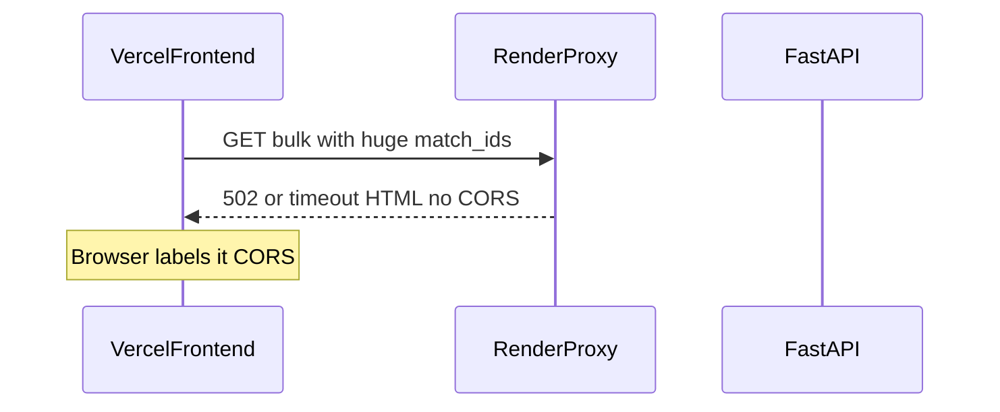

<!-- ff383a97-0c71-452f-95b0-99ab8da651fd -->
---
todos:
  - id: "chunk-bulk-fetch"
    content: "Chunk bulk fetches in PlayerPanel; omit match_ids when all selected"
    status: pending
  - id: "loading-ui"
    content: "Add court skeleton + progressive status while chunks load"
    status: pending
  - id: "backend-safety"
    content: "Optional 400 on oversized match_ids; redeploy notes"
    status: pending
isProject: false
---
# Fix bulk CORS + progressive serve loading

## What’s actually broken

This is **not a CORS misconfig**. [`backend/main.py`](backend/main.py) already has `allow_origins=["*"]`.

When you “Select all” for Sinner on hard, [`PlayerPanel`](frontend/src/app/matchsimulator/page.js) builds one GET:

```js
params.set("match_ids", selectedMatchIds.join(","));
fetch(`${API_BASE}/getPlayerServesBulk/${encName}?surface=hard&match_ids=...huge...`)
```

That fails because:

1. **URL too long** — dozens of long `match_id`s blow past proxy/browser URL limits.
2. **Render timeout** — even if the URL works, one giant bulk can run longer than Render’s free request limit. The proxy then returns an error page **without** CORS headers → Chrome reports “No Access-Control-Allow-Origin”.

Small single-match requests still work, which is why it looks like “CORS only on bulk.”



## Fix strategy (concrete)

**Progressive chunked client fetches** (chosen over “wait for one big response”): shorter URLs, under timeout limits, and the court fills as data arrives.

### 1. Frontend: chunk bulk loads in `PlayerPanel`

In [`frontend/src/app/matchsimulator/page.js`](frontend/src/app/matchsimulator/page.js) (`PlayerPanel` effect ~315–351):

- If **all** listed matches for the surface are selected → call bulk with **only** `surface` (omit `match_ids`). Backend already supports that path.
- Else → split `selectedMatchIds` into chunks of **~15** IDs.
- For each chunk, `GET /getPlayerServesBulk/...?surface=...&match_ids=id1,id2,...`
- **Append** points as each chunk resolves (`setBulkPoints(prev => prev.concat(...))`).
- Track `bulkLoading`, `loadedMatchCount` / total for status text like `Loading… 4/12 matches`.
- Clear points when selection changes; cancel in-flight work with an abort/`cancelled` flag.
- On chunk failure: keep already-loaded points, show a short error line (don’t wipe everything).

Extract a tiny helper in the same file or `frontend/src/app/lib/fetchBulkServes.js` to keep `PlayerPanel` readable:

```js
async function fetchServesChunk(player, surface, matchIds) { /* returns {points, match_count} */ }
```

### 2. Frontend: loading UI (not a blank wait)

While `bulkLoading` and `bulkPoints.length === 0`: show a **court-sized skeleton** (zinc pulse block matching court aspect) inside the player card instead of an empty court.

While loading **with** some points already: keep rendering `<TennisCourt points={bulkPoints} />` and show status above: `Loading serves… 3/12 matches`.

No new dependency — Tailwind pulse skeleton only.

### 3. Backend: leave CORS alone; harden bulk slightly

In [`backend/main.py`](backend/main.py):

- No CORS change needed.
- Keep existing bulk endpoint.
- Optional small safety: if `match_ids` query string is enormous, reject with `400` JSON (still has CORS) — secondary; chunking is the real fix.
- Ensure deployed Render service is restarted after any backend deploy so it has current code.

### 4. Deploy checklist (you run)

- Redeploy frontend after chunking ships.
- Confirm Render logs for the failing request (expect 502/timeout today; expect many short 200s after).
- Retest: Select all Sinner hard matches from `https://tennis-simulation.vercel.app`.

## Out of scope

- Redis / rewriting CORS middleware
- SSE/WebSocket streaming from the server (chunked GETs are enough)
- Changing single-match `/getPlayerServes` path

## Verify

- Select all hard matches for a busy player: no CORS error; points appear in waves; status counts up; skeleton only before first chunk.
- Subset of 3–5 matches: still one or few chunks, correct aggregation.
- Single match: unchanged (still uses `/getPlayerServes`, not bulk).
