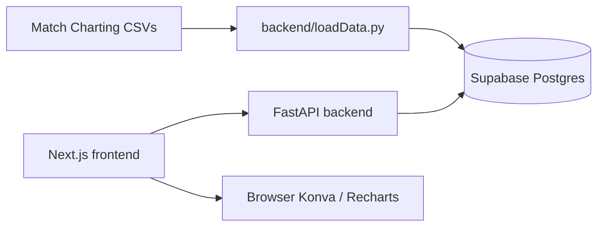

# Agent guide — TennisSimulation (Tennis Visualizer)

This document is the **canonical map of the repository** for coding agents (Codex, Cursor, etc.). Read this before changing behavior, APIs, or data loading.

Human-oriented quick start remains in [`README.md`](README.md).

---

## Purpose

**Tennis Visualizer** is a web app for exploring **ATP men’s match-charting data** from Jeff Sackmann’s [Tennis Abstract Match Charting Project](https://github.com/JeffSackmann/tennis_MatchChartingProject) (CC BY-NC-SA 4.0).

Users can:

1. **View ATP Matches** (`/matchsimulator`) — pick player(s), surface, and matches; plot **serve locations** on a Konva tennis court (scatter or heatmap) with outcome/pressure filters.
2. **Improvement tracker** (`/progress`) — per-match timeline of serve stats (points won on serve %, hold %, times broken), optional rolling average, linear trend, and two-period comparison with basic stats tests.

There is **no user auth**. The frontend talks to a **FastAPI** backend; the backend reads **Supabase (Postgres)** via the anon/publishable key. Raw CSVs are **not** served at runtime — they are ingested into Supabase offline.

---

## Repository layout

```
TennisSimulation/
├── AGENTS.md              ← this file
├── README.md              ← human setup / run instructions
├── Makefile               ← install, dev, backend, frontend
├── package.json           ← root deps (minimal; @vercel/analytics)
├── backend/
│   ├── main.py            ← FastAPI routes, pagination, bulk fetch
│   ├── db.py              ← Supabase client (env vars)
│   ├── cache.py           ← process-local TTL cache
│   ├── supabase_pool.py   ← thread pool + global Supabase concurrency cap
│   ├── loadData.py        ← CSV → Supabase upsert pipeline
│   ├── PointsParse.py     ← charting notation reference + parse helpers
│   ├── requirements.txt
│   ├── .env               ← gitignored; Supabase URL + key
│   └── sql/
│       └── create_supabase_schema_migrations.sql  ← optional Studio fix only
├── frontend/              ← Next.js 16 App Router
│   ├── AGENTS.md          ← Next.js version warning (read before frontend edits)
│   ├── src/app/           ← pages + feature components + domain libs
│   ├── src/components/ui/ ← shadcn-style UI (combobox, input-group, etc.)
│   └── src/lib/           ← api.js, cache.js, utils
└── Data/                  ← optional local CSVs for loadData.py (often gitignored)
    ├── charting-m-matches.csv
    └── charting-m-points-2020s.csv
```

**Do not commit** `backend/.env`, `frontend/.env.local`, `.venv/`, or `docs/private/` (see `.gitignore`).

---

## Architecture (data flow)



1. **Ingestion (offline):** `loadData.py` parses point strings (`1st` / `2nd` columns) via `extract_point_summary()` and upserts rows into `points`. Player names sync to `players`. Match metadata upsert exists in code but may be **commented out** in `_run_load_pipeline()` — production DB may already have `matches` loaded separately.
2. **Runtime:** UI calls FastAPI; FastAPI paginates Supabase `.select()` queries, optionally caches lists, enriches bulk points with match metadata (surface, tournament, round, date).
3. **Presentation:** Frontend converts point rows → court coordinates (`serveShots.js`, `courtUtils.js`) or → match-level metrics (`serveProgress.js`).

---

## Database (Supabase / Postgres)

The app expects three application tables. Schema is implied by [`backend/loadData.py`](backend/loadData.py) and [`backend/main.py`](backend/main.py) — there is **no** checked-in SQL migration for app tables; data is loaded via Python upserts.

### `matches`

| Column | Role |
|--------|------|
| `match_id` | Primary key. Format: `YYYYMMDD-M-Tournament-Round-Player1-Player2` |
| `player1`, `player2` | Full names; must match charting CSV naming |
| `surface` | `Hard`, `Clay`, or `Grass` (capitalized in DB) |
| `tournament`, `round` | Display / filters |
| `winner` | Optional `1` or `2` (match winner slot) |

**Indexes:** Backend queries use `.eq("player1", name)` and `.eq("player2", name)` separately (avoids PostgREST `.or_()`). Surface filter uses `.eq("surface", surface_norm)`.

### `players`

| Column | Role |
|--------|------|
| `name` | Primary key / unique (`on_conflict="name"`) |

Populated by `upsert_players()` from CSV or `backfill_players_from_supabase()`. **`GET /getAllPlayers`** reads this table first; if empty, scans all `matches` for unique names (slow but works).

### `points`

| Column | Role |
|--------|------|
| `match_id`, `point_number` | Unique pair (`on_conflict='match_id,point_number'`) |
| `server`, `winner` | `1` = player1, `2` = player2 |
| `game_number` | **Required** for Progress page holds/breaks (groups points into service games) |
| `score`, `set1`, `set2`, `game1`, `game2` | Score state; used for deuce/ad side and pressure logic |
| `first_serve_direction`, `first_serve_outcome` | Parsed: `wide` / `body` / `T`; outcomes include `Ace`, `Unreturnable`, `in_play`, faults |
| `second_serve_direction`, `second_serve_outcome` | Present when `had_fault` |
| `had_fault` | Boolean |
| `point_end` | Rally or serve terminal outcome |
| `first`, `second` | Raw charting strings (stored on load; not all API responses include them) |
| `return_type`, `return_direction`, `return_depth` | Parsed on load; limited use in current UI |

**Critical:** Bulk API selects a fixed column list (`POINT_SELECT` in `main.py`). If you add columns for new features, update both loader and `POINT_SELECT`.

### Supabase connection

[`backend/db.py`](backend/db.py):

```python
NEXT_PUBLIC_SUPABASE_URL
NEXT_PUBLIC_SUPABASE_PUBLISHABLE_KEY  # anon/publishable; needs SELECT on matches, points, players
```

Same variable names as frontend convention; backend loads from `backend/.env` via `python-dotenv`.

### `supabase_migrations.schema_migrations`

Optional metadata table for Supabase Studio only — **not used by the app**. SQL: [`backend/sql/create_supabase_schema_migrations.sql`](backend/sql/create_supabase_schema_migrations.sql).

---

## Backend (FastAPI)

**Entry:** `uvicorn main:app` from `backend/` (see Makefile).

### Middleware

- CORS: `allow_origins=["*"]` (browser may still fail on **timeouts** before CORS headers — see bulk fetch notes).

### Concurrency & cache

- [`supabase_pool.py`](backend/supabase_pool.py): shared `ThreadPoolExecutor` (`SUPABASE_EXECUTOR_WORKERS`, default 8) and global semaphore (`SUPABASE_MAX_INFLIGHT`, default 8) wrapping every sync `.execute()`.
- [`cache.py`](backend/cache.py): in-process TTL dict — **requires `uvicorn --workers 1`**. Keys: all players (30 min), per-player matches (10 min). Empty player list is **never** cached.
- Optional `POST /admin/cache/clear` with header `x-cache-admin-secret` if `CACHE_ADMIN_SECRET` is set in env.

### HTTP API

| Method | Path | Description |
|--------|------|-------------|
| GET | `/` | `{ "status": "ok" }` |
| GET | `/getAllPlayers` | `{ "players": string[] }` |
| GET | `/getPlayerMatches/{player_name}?surface=` | `{ "matches": Match[] }` — merges player1 and player2 queries |
| GET | `/getPlayerServes/{match_id}/{player_name}` | Serve points for one match where `server` = that player’s slot |
| GET | `/getPlayerServesBulk/{player_name}?match_ids=&surface=` | Many matches; points tagged with `surface`, `tournament`, `round`, `date` |
| POST | `/admin/cache/clear` | If secret configured |

**Pagination:** All large selects use `_paginate_select()` with `PAGE_SIZE = 1000`.

**Bulk points:** Match IDs batched in groups of `MATCH_ID_BATCH = 80`; server slot 1 vs 2 fetched in parallel via `SHARED_EXECUTOR` (flat job list — no nested pool submits).

**Surface normalization:** First letter uppercased (`hard` → `Hard`).

**Date on bulk points:** Parsed from first 8 chars of `match_id` when not otherwise present.

**Limits:** Query string `match_ids` capped (~3500 chars) — clients must chunk (frontend uses 15 IDs per request).

### Point parsing (ingestion)

See **[Decoding raw Match Charting data](#decoding-raw-match-charting-data)** below for the full notation. Implementation: [`PointsParse.py`](backend/PointsParse.py) (`split_leading_serve`, `parse_shot_sequence`) and [`loadData.py`](backend/loadData.py) (`extract_point_summary`).

**Loader commands:**

```bash
cd backend && ../.venv/bin/python loadData.py              # points pipeline + player backfill
cd backend && ../.venv/bin/python loadData.py --backfill-players
```

CSV paths (relative to `backend/`): `../Data/charting-m-matches.csv`, `../Data/charting-m-points-2020s.csv`. Only Hard/Clay/Grass matches kept.

---

## Decoding raw Match Charting data

**Source of truth for agents:** Jeff Sackmann’s Match Charting Project notation (CC BY-NC-SA 4.0). Raw strings live in CSV columns `1st` / `2nd` (and are stored on Supabase `points.first` / `points.second`). Do **not** invent codes; decode with this section (and the maps in [`PointsParse.py`](backend/PointsParse.py)).

Upstream: [tennis_MatchChartingProject](https://github.com/JeffSackmann/tennis_MatchChartingProject).

### How a point is stored

| Rule | Meaning |
|------|---------|
| Only `1st` filled | First serve landed in; **entire point** (serve + rally) is in `1st`. |
| Both `1st` and `2nd` filled | `1st` is the **fault only** (direction + fault letter). `2nd` has the second serve + rally. |
| `2nd` blank | No second serve. |

**Examples (from official guide):**

- `1st = 6f27b1*` → T serve in, then rally `f27b1*`.
- `1st = 5d`, `2nd = 4s39b3b1w@` → body serve fault deep; wide second serve in, then rally.

Every individual shot (including serves) is coded. Numbers = direction/depth; letters = shot types / error types; symbols = winners, forced/unforced, approaches, etc. Codes are **case-sensitive**.

### Serves

**Direction** (same codes in deuce and ad court):

| Code | Meaning |
|------|---------|
| `4` | Out wide |
| `5` | Body |
| `6` | Down the T |
| `0` | Unknown direction |

**Fault letters** (after direction when the serve is out):

| Code | Meaning |
|------|---------|
| `n` | Net (incl. non-let net cords into the net) |
| `w` | Wide |
| `d` | Deep |
| `x` | Both wide and deep |
| `g` | Foot fault |
| `e` | Unknown fault type |
| `!` | Shank (rare; use instead of fault letter) |
| `V` | Time violation (loses first serve) |

**Lets:** optional leading `c` (repeatable), e.g. `cc4e` = two lets then wide fault, unknown direction.

**Serve-and-volley:** optional `+` after direction, e.g. `4+w` = wide S&V attempt that went deep; `4+…` then rally if the serve is in.

**Serve-only point endings** (no full return/rally):

| Code | Meaning |
|------|---------|
| `*` | Ace (e.g. `5*`) |
| `#` on the serve | Unreturnable (returner barely touches / can’t get it over the net), e.g. `6#` |

Return errors after an in serve are coded as rally shots ending in `#` (forced) or `@` (unforced), e.g. `6f#`, `6f2d@`. Rough rule of thumb from the guide: first-serve return errors often forced; second-serve return errors often unforced (not absolute).

### Rally sequence (after the serve that landed in)

Typical shot after the serve: **letter (type) + number (direction)**. Direction may be omitted when learning/charting lightly.

**Shot types:**

| Code | Shot |
|------|------|
| `f` / `b` | Forehand / backhand groundstroke (not slices) |
| `r` / `s` | FH / BH slice (incl. defensive chips; not drop shots) |
| `v` / `z` | FH / BH volley |
| `o` / `p` | Standard / “backhand” overhead |
| `u` / `y` | FH / BH drop shot |
| `l` / `m` | FH / BH lob |
| `h` / `i` | FH / BH half-volley |
| `j` / `k` | FH / BH swinging volley |
| `t` | Trick shots (tweeners, behind-back, etc.) |
| `q` | Unknown shot type |

**Shot direction** (where the ball crossed / would cross the **opponent’s baseline**):

| Code | Meaning |
|------|---------|
| `1` | Toward a righty’s **forehand** side / lefty’s backhand side |
| `2` | Down the middle (~middle ~40% of the court) |
| `3` | Toward a righty’s **backhand** side / lefty’s forehand side |
| `0` | Unknown |

Examples: `f1` = typical RH crosscourt FH; `s2` = BH slice middle; `u3` = FH drop to RH opponent’s BH.

> **Agent note:** Official Sackmann direction is **side of court relative to handedness**, not “down-the-line / crosscourt” labels. Some comments/maps in `PointsParse.py` (`DIRECTIONS`) historically mislabel `1`/`2`/`3` — prefer this table when decoding or fixing parsers.

### Rally endings

- **Winner:** append `*` — e.g. `f3*`.
- **Error:** include the attempted shot, then optional error location (`n`/`w`/`d`/`x`/`!`/`e`/`g`), then:
  - `@` = **unforced** error (shot type + error type + `@` required; direction optional)
  - `#` = **forced** error (shot type + `#` enough, e.g. `b#`; more detail allowed, e.g. `b3d#`)

Full cell example: `5f2f1f1v2n@` = body serve in + rally ending with unforced net volley.

### Optional return depth (service returns that land in)

Three keystrokes when fully charted: type + direction + depth:

| Code | Depth |
|------|-------|
| `7` | Inside the service boxes |
| `8` | Behind service line, closer to service line than baseline |
| `9` | Closer to baseline than service line |
| `0` | Unknown (or omit) |

Example: `f37` = FH return to RH opponent’s BH side, short (in the boxes).

### Optional court-position / special symbols

| Code | Meaning |
|------|---------|
| `+` | Approach shot (after shot code, e.g. `b+2`); also S&V on serves |
| `-` | Shot at the **net** when the shot type would normally be baseline |
| `=` | Shot at the **baseline** when the shot type would normally be net (e.g. baseline smash `o=2`) |
| `^` | Stop / drop volley (e.g. `z^2*`) |
| `;` | Net cord on that shot (e.g. `f;1*`) |
| `C` | Play stopped for a **wrong** challenge/mark check (adjust to error if challenge correct) |

### Incomplete / special whole-point codes (usually alone in `1st`)

| Code | Meaning |
|------|---------|
| `S` | Missed charting; award point to **server** |
| `R` | Missed charting; award point to **returner** |
| `P` | Point penalty against **server** |
| `Q` | Point penalty against **returner** |

Notes column: free text (challenges, medical timeouts, coaching, etc.); avoid commas. Events between points go on the **preceding** point’s notes.

### CSV columns agents care about

**Matches** (`charting-m-matches.csv` → `matches`): `match_id` (`YYYYMMDD-M-Tournament-Round-Player1-Player2`), `Player 1` / `Player 2`, hands, date, tournament, round, surface, best-of, final-set TB flag, etc.

**Points** (`charting-m-points-*.csv` → `points`):

| CSV | DB / API | Role |
|-----|----------|------|
| `Pt` | `point_number` | Order within match |
| `Pts` | `score` | Game score at **start** of point (`0-0`, `40-AD`, or tiebreak `6-6`, …) |
| `Gm#` | `game_number` | Service-game grouping (holds/breaks) |
| `Set1`/`Set2`, `Gm1`/`Gm2` | `set1`…`game2` | Scoreboard at start of point |
| `Svr` | `server` | `1` or `2` |
| `PtWinner` | `winner` | `1` or `2` |
| `1st` / `2nd` | `first` / `second` | Raw sequences above |
| — | `first_serve_direction`, `*_outcome`, `had_fault`, `return_*`, `point_end` | Derived at load time |

**Tiebreak detection:** `Gm1==6` and `Gm2==6` (or `3`/`3` for NextGen 4-game sets) — not the `TbSet` column (set-level flag only).

### How this repo uses the strings

1. **`loadData.extract_point_summary`** — pulls first/second serve direction + outcome, return type/direction/depth, `had_fault`, `point_end` for Supabase.
2. **`PointsParse.split_leading_serve`** — strips leading `c` lets; parses `4`/`5`/`6`/`0` + optional `+`/`^`/`-`/`=` + fault/ace/`#`; returns rally rest.
3. **`PointsParse.parse_shot_sequence`** — shot list for full rally decode (serve fault in `1st` when `2nd` present, then in-play serve + rally chars).
4. **UI today** — mainly serve direction/outcome for the court (`wide`/`body`/`T`, Ace / Unreturnable / in_play / faults). Full rally decoding is available in code but not the primary product surface yet.

When changing parsers, keep Sackmann’s rules above as the semantic target; update unit expectations and `POINT_SELECT` / frontend filters accordingly.

---

## Frontend (Next.js)

**Read [`frontend/AGENTS.md`](frontend/AGENTS.md)** — Next.js 16 in this repo may differ from older training data; check `node_modules/next/dist/docs/` when unsure.

### Config

- API base: [`frontend/src/lib/api.js`](frontend/src/lib/api.js) — `NEXT_PUBLIC_API_URL` or default `http://127.0.0.1:8000`.
- Client cache: [`frontend/src/lib/cache.js`](frontend/src/lib/cache.js) — `localStorage` for players (24h) and match lists (1h).

### Routes

| Path | File | Role |
|------|------|------|
| `/` | `src/app/page.js` | Hub links |
| `/matchsimulator` | `src/app/matchsimulator/page.js` | Main court UI |
| `/progress` | `src/app/progress/page.js` | Timeline + stats |
| `/why` | `src/app/why/page.js` | Static rationale |

### Match simulator flow

1. Load players: `GET /getAllPlayers` (cached).
2. User selects 1 or 2 players + surface → `GET /getPlayerMatches/{name}?surface=`.
3. User selects one or more `match_id`s → progressive `GET /getPlayerServesBulk/{name}?match_ids=...` via [`fetchBulkServes.js`](frontend/src/app/lib/fetchBulkServes.js) (`BULK_MATCH_CHUNK_SIZE = 15`).
4. Points → [`pointsToServeShots`](frontend/src/app/lib/serveShots.js) → [`TennisCourt.jsx`](frontend/src/app/components/TennisCourt.jsx) → `ShotLayer` (scatter) or `ServeHeatmapLayer` (simpleheat).
5. Single-match modals still call `GET /getPlayerServes/{match_id}/{player}` from `ShotLayer`, `ServeHeatmapLayer`, `ServeAnalyticsModal`.

**Filters:** serve outcome, pressure points (break/set/tiebreak logic in `serveShots.js`), point won/lost, scatter vs heatmap.

**Court geometry:** [`courtConstants.js`](frontend/src/app/lib/courtConstants.js), [`courtUtils.js`](frontend/src/app/lib/courtUtils.js) — deuce (`D`) vs ad (`A`) side from score; serve zones wide/body/T.

### Progress flow

1. Players from `/getAllPlayers` (sessionStorage cache key `tennis-all-players`).
2. All match IDs for player (+ optional surface) from `/getPlayerMatches`.
3. Bulk serve points in chunks (same as simulator).
4. [`metricsByMatch`](frontend/src/app/lib/serveProgress.js) aggregates per match:
   - Requires `game_number` on points.
   - Skips tiebreak games for hold/break; requires ≥ `MIN_SERVICE_GAMES` (3) service games per match to include row.
5. Charts: Recharts line chart; optional rolling window (10 matches), linear trend ([`stats.js`](frontend/src/app/lib/stats.js)), period A vs B with Wilson CI / two-proportion z-test / Fisher’s exact where applicable.

### UI components

- Feature components: `src/app/components/` (Header, TennisCourt, player boxes, etc.).
- Design system: `src/components/ui/` — Base UI + shadcn patterns (`combobox`, `input-group`, `button`, …).
- Styling: Tailwind 4, Geist fonts, zinc palette.

### Tests

```bash
npm --prefix frontend run test:stats   # node:test for stats.js
```

---

## Local development

```bash
make install   # .venv + pip + npm in frontend/
# Create backend/.env with Supabase vars (see README)
make dev       # parallel: Next :3000, API :8000
```

Individual targets: `make backend`, `make frontend`.

---

## Production / ops pitfalls (agents must respect)

1. **Single uvicorn worker** if relying on backend TTL cache.
2. **Always chunk `match_ids`** for bulk serve fetch — full-career one-shot requests exceed ~30s on typical hosts and look like CORS errors in the browser.
3. **`game_number` must exist** on point rows or Progress timeline will be empty.
4. **Do not cache empty player lists** on backend or frontend (handled in code — preserve this invariant if touching cache).
5. **Player name normalization:** whitespace collapsed in backend; search on frontend matches **word prefixes** ([`playerSearch.js`](frontend/src/app/lib/playerSearch.js)).
6. **License:** Match Charting data is CC BY-NC-SA 4.0 — do not expose raw dumps publicly without compliance.

---

## Common change patterns

| Goal | Touch |
|------|--------|
| New API field on points | `loadData.py` batch dict, `POINT_SELECT` in `main.py`, frontend consumers |
| New chart metric | `serveProgress.js` + `progress/page.js` |
| New court filter | `serveShots.js` + `matchsimulator/page.js` |
| Faster player list | Backfill `players` table; avoid `_players_from_matches_scan` |
| New page | `src/app/<route>/page.js`, link from `page.js` / `header.jsx` |
| DB schema change | Supabase dashboard + loader upsert keys; no Flyway in repo |

---

## Related docs

- [`README.md`](README.md) — setup, env vars, Makefile
- **[Decoding raw Match Charting data](#decoding-raw-match-charting-data)** (this file) — how to decode `1st` / `2nd` strings
- [`backend/PointsParse.py`](backend/PointsParse.py) — parser maps + `split_leading_serve` / `parse_shot_sequence`
- [`frontend/AGENTS.md`](frontend/AGENTS.md) — Next.js-specific agent rules
